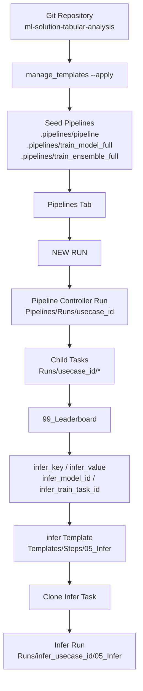
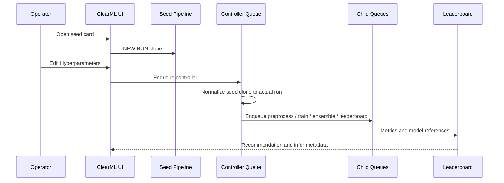

# Setup Guide

このドキュメントは、次の前提でこの solution を新規に立ち上げる人向けの手順書です。

- 新しい Git アカウント上の別 repository に移した
- 新しい PC でセットアップする
- 既存とは別の ClearML サーバーを使う
- この codebase をまだよく知らない

目的は、**初期設定から学習 pipeline の rehearsal、学習済みモデルを使った infer rehearsal までを UI 中心で再現できること**です。

## 1. この guide で分かること

この guide を読むと、次のことが分かります。

1. 新しい Git repository に移したあと、どこを変える必要があるか
2. 新しい PC で何を install すればよいか
3. 新しい ClearML サーバーへどう接続するか
4. seed pipeline / step template をどう同期するか
5. `Pipelines` タブから学習 pipeline をどう実行するか
6. `99_Leaderboard` から推論対象モデルをどう選ぶか
7. `infer` task をどこで clone して、どう実行するか

## 2. 全体像

現在の標準運用は、**学習は seed pipeline card から `NEW RUN`、推論は infer template task を clone**です。



重要な用語:

- seed pipeline
  - UI の入口になる completed な基準 pipeline
- actual run
  - seed を `NEW RUN` した実際の controller run
- child task
  - preprocess / train / ensemble / leaderboard などの実行 task
- infer template
  - 推論専用の step template task

## 3. repository と依存の考え方

この solution は現状 **polyrepo 前提**です。

- solution repo
  - `ml-solution-tabular-analysis`
- platform repo
  - `ml_platform`

通常依存は Git URL の `ml-platform` です。

- [pyproject.toml](d:/tabular_clearml/ml_taularanalysis_v1-master/pyproject.toml)
- [requirements/base.txt](d:/tabular_clearml/ml_taularanalysis_v1-master/requirements/base.txt)

つまり、**solution repo だけ別アカウントの別 repo に移した**場合は、そのままでも動くことが多いです。  
一方で、**`ml_platform` 側も別 repo に移した**なら、依存 URL を更新する必要があります。

更新対象:

- [pyproject.toml](d:/tabular_clearml/ml_taularanalysis_v1-master/pyproject.toml)
- [requirements/base.txt](d:/tabular_clearml/ml_taularanalysis_v1-master/requirements/base.txt)
- [uv.lock](d:/tabular_clearml/ml_taularanalysis_v1-master/uv.lock)

## 4. 新しい Git repository へ移したときの確認事項

### 4.1 solution repo だけ移した場合

最低限これを確認します。

```powershell
git clone <YOUR_NEW_SOLUTION_REPO_URL>
cd ml_taularanalysis_v1-master
git remote -v
```

この場合、`ml_platform` の依存先が変わらないなら、コード変更は不要です。

### 4.2 `ml_platform` も別 repo に移した場合

`ml-platform` 依存 URL を新しい repository に向けます。

例:

```toml
"ml-platform @ git+https://github.com/<new-account>/<new-ml-platform-repo>@main"
```

更新後は lock を更新します。

```powershell
uv lock
uv sync --frozen
```

### 4.3 private repository の場合

ClearML Agent は remote 実行時に repo と dependency を取得できる必要があります。  
private repo の場合は、次のいずれかが必要です。

- Agent が Git へアクセスできる認証を持つ
- 依存パッケージを wheel / package として配布する
- `ml_platform` を path dependency に切り替える

## 5. 新しい PC でのセットアップ

### 5.1 必須ソフト

- Python 3.10+
- Git
- `uv`
- ClearML を使う場合:
  - `clearml.conf` または `CLEARML_*` 環境変数
- agent を Docker で動かす場合:
  - Docker Desktop
  - Docker Compose

### 5.2 clone

```powershell
cd D:\
mkdir work
cd work
git clone <YOUR_SOLUTION_REPO_URL> ml_taularanalysis_v1-master
cd ml_taularanalysis_v1-master
```

### 5.3 install

標準:

```powershell
uv sync --frozen
```

主要な学習モデル込み:

```powershell
uv sync --frozen --extra lightgbm --extra xgboost --extra catboost
```

API も使う場合:

```powershell
uv sync --frozen --extra api
```

### 5.4 任意: sibling checkout

platform 側もローカルで読みたい場合は、次の並びが分かりやすいです。

```text
d:\work\
  ml_platform_v1-master\
  ml_taularanalysis_v1-master\
```

ただし、現在の標準 runtime は Git dependency 前提です。  
この sibling 配置は **ローカル開発を追いやすくする補助**であり、ClearML Agent が自動的に sibling repo を使うわけではありません。

## 6. 新しい ClearML サーバーへの接続

### 6.1 `clearml.conf` を使う方法

PowerShell:

```powershell
$env:CLEARML_CONFIG_FILE = "D:\path\to\clearml.conf"
```

### 6.2 環境変数を使う方法

```powershell
$env:CLEARML_API_HOST = "http://<your-clearml-host>:8008"
$env:CLEARML_WEB_HOST = "http://<your-clearml-host>:8080"
$env:CLEARML_FILES_HOST = "http://<your-clearml-host>:8081"
$env:CLEARML_API_ACCESS_KEY = "<access-key>"
$env:CLEARML_API_SECRET_KEY = "<secret-key>"
```

### 6.3 接続確認

最低限確認すること:

- ブラウザで ClearML UI にログインできる
- API key が有効
- fileserver URL が到達可能

## 7. ClearML Agent のセットアップ

学習 pipeline を remote 実行するには、少なくとも次の queue に worker が必要です。

- `controller`
- `default`
- `heavy-model`

正本 compose:

- [compose.yaml](d:/tabular_clearml/ml_taularanalysis_v1-master/tools/clearml_agent/compose.yaml)
- [tools/clearml_agent/.env.example](d:/tabular_clearml/ml_taularanalysis_v1-master/tools/clearml_agent/.env.example)

### 7.0 新しい Git repo / 新しい PC / 新しい ClearML サーバーでの推奨設定

この状況では、agent 設定で最低限そろえるべきものは次です。

| 項目 | 推奨値 | 理由 |
| --- | --- | --- |
| ClearML API host | `http://<host>:8008` | agent が API に接続するため |
| ClearML Web host | `http://<host>:8080` | UI URL 解決に使うため |
| ClearML Files host | `http://<host>:8081` | artifact upload/download のため |
| API access key | server ごとの発行値 | queue / task 実行に必須 |
| API secret key | server ごとの発行値 | queue / task 実行に必須 |
| Docker network | `docker_backend` か組織標準名 | server 到達性をそろえるため |
| image name | `table-analysis-clearml-agent:latest` | 既定のままで可。必要なら env で差し替え |
| `/root/.clearml` | named volume | Windows bind mount 起因の停止を避けるため |
| `UV_CACHE_DIR` | `/root/.clearml/uv-cache` | bootstrap を安定化するため |

まずは `.env.example` を `.env` にコピーして使うのが一番安全です。

```powershell
cd tools\clearml_agent
copy .env.example .env
```

そのうえで `.env` を自分の環境に合わせて更新します。

### 7.1 Docker network

現在の compose は `docker_backend` という external network を使います。  
新しい PC で無ければ先に作成してください。

```powershell
docker network create docker_backend
```

別名を使いたい場合は `.env` の `CLEARML_DOCKER_NETWORK` を変更してください。

### 7.2 agent 起動

```powershell
cd tools\clearml_agent
docker compose up -d --build
```

別の image tag を使いたい場合は `.env` の `CLEARML_AGENT_IMAGE` を変更できます。

### 7.3 確認

ClearML UI の Workers / Queues で次を確認します。

- `controller` に worker がいる
- `default` に worker がいる
- `heavy-model` に worker がいる

queue の役割:

- `controller`
  - pipeline controller 用
- `default`
  - preprocess, 軽量モデル, leaderboard, ensemble など
- `heavy-model`
  - `catboost`, `xgboost` など重いモデル

### 7.4 新しい Git repo に移したときの agent 観点の確認

agent は controller / child task 実行時に、task script に埋め込まれた solution repo を clone します。  
そのため、新しい Git repository に移したあとは **template / seed を再同期**して、task script の repository / branch を新しい repo に向ける必要があります。

```powershell
python tools/clearml_templates/manage_templates.py --apply --project-root LOCAL
python tools/clearml_templates/manage_templates.py --validate --project-root LOCAL
```

確認ポイント:

- task script の `repository` が新しい solution repo になっている
- `entry_point` が `tools/clearml_entrypoint.py` のまま
- branch / commit の参照が新しい repo 上で有効

### 7.5 `ml_platform` も別 repo に移したときの agent 観点の確認

current runtime では、solution repo の dependency として `ml-platform` を取得します。  
したがって、`ml_platform` も別 repo に移した場合は、solution repo 側の依存更新が必要です。

更新対象:

- `pyproject.toml`
- `requirements/base.txt`
- `uv.lock`

この更新をしないと、agent は新しい solution repo を clone できても、古い `ml_platform` 依存 URL を見に行きます。

### 7.6 private Git repo の場合

private repo の場合は、agent が remote 実行中に次へアクセスできる必要があります。

- solution repo
- `ml_platform` repo

推奨順:

1. 可能ならまず public / internal read-only で動作確認する
2. private にする場合は、agent コンテナから Git に read access できる認証を用意する
3. それが難しい場合は、`ml_platform` を package / wheel として配布する

この repo では認証方式を固定していません。組織ごとの標準に合わせてください。  
少なくとも次は確認してください。

- agent container から target Git host に reach できる
- task script の `repository` URL が agent から clone 可能
- dependency の Git URL も agent から clone 可能

## 8. seed pipeline / step template を同期する

新しい ClearML サーバーで最初に必ずやる操作です。

```powershell
python tools/clearml_templates/manage_templates.py --apply --project-root LOCAL
python tools/clearml_templates/manage_templates.py --validate --project-root LOCAL
```

`LOCAL` は例です。  
新しい運用 namespace にしたいなら、`LAB`, `DEV`, `MFG` などへ変えて構いません。

### 8.1 何が作られるか

step template:

- `dataset_register`
- `preprocess`
- `train_model`
- `train_ensemble`
- `leaderboard`
- `infer`

seed pipeline:

- `pipeline`
- `train_model_full`
- `train_ensemble_full`

### 8.2 UI 上の場所

step template:

- `<project_root>/TabularAnalysis/Templates/Steps/01_Datasets`
- `<project_root>/TabularAnalysis/Templates/Steps/02_Preprocess`
- `<project_root>/TabularAnalysis/Templates/Steps/03_TrainModels`
- `<project_root>/TabularAnalysis/Templates/Steps/04_Ensembles`
- `<project_root>/TabularAnalysis/Templates/Steps/05_Infer`
- `<project_root>/TabularAnalysis/Templates/Steps/99_Leaderboard`

seed pipeline:

- `<project_root>/TabularAnalysis/.pipelines/pipeline`
- `<project_root>/TabularAnalysis/.pipelines/train_model_full`
- `<project_root>/TabularAnalysis/.pipelines/train_ensemble_full`

## 9. 学習 pipeline rehearsal の前提

### 9.1 raw dataset id がある場合

最短です。  
seed pipeline の `NEW RUN` で `data.raw_dataset_id` にその id を入れます。

### 9.2 raw dataset id が無い場合

まず `dataset_register` を流して id を作ります。

```powershell
python -m tabular_analysis.cli task=dataset_register `
  run.clearml.enabled=true `
  run.clearml.execution=logging `
  run.clearml.project_root=LOCAL `
  data.dataset_path=D:/path/to/data.csv `
  data.target_column=target
```

成功すると raw dataset id が得られます。  
この id を学習 pipeline の `data.raw_dataset_id` に使います。

## 10. 学習 pipeline を UI から rehearsal する

現在の正規入口は `Pipelines` タブの seed card です。

seed の使い分け:

| seed | 内容 | 典型用途 |
| --- | --- | --- |
| `pipeline` | preprocess + single-model train + leaderboard | 標準学習 |
| `train_model_full` | preprocess + single-model train | 単体モデルのみ |
| `train_ensemble_full` | preprocess + single-model train + ensemble + leaderboard | フル構成 |

### 10.1 手順

1. ClearML UI の `Pipelines` タブを開く
2. seed card を開く
3. `NEW RUN`
4. `Configuration > OperatorInputs` を先に確認する
5. `Hyperparameters` を開く
6. 必要な値を編集する
7. 実行する

### 10.2 `OperatorInputs` と `Hyperparameters` の違い

| 画面 | 役割 | 編集するか |
| --- | --- | --- |
| `Configuration > OperatorInputs` | 確認用 mirror | しない |
| `Hyperparameters` | 実行ソースの正本 | する |

### 10.3 通常編集する項目

- `run.usecase_id`
- `data.raw_dataset_id`
- `pipeline.selection.enabled_preprocess_variants`
- `pipeline.selection.enabled_model_variants`
- `ensemble.selection.enabled_methods`
- `ensemble.top_k`

### 10.4 placeholder の意味

seed card には次の placeholder が入ります。

```text
REPLACE_WITH_EXISTING_RAW_DATASET_ID
```

これは **seed 上では正常**です。  
ただし actual run では placeholder のまま開始すると fail-fast します。  
必ず `Hyperparameters` で実在する raw dataset id に差し替えてください。

### 10.5 `run.usecase_id` の扱い

- 自分で分かりやすい値を入れてもよい
- seed 既定値 `TabularAnalysis` のままでもよい

既定値のままでも、actual run では runtime が一意な usecase id に変換します。

例:

```text
test_e285ff784b9046b7b1f9920e54e3fe93_20260405_140419
```

### 10.6 実行後の場所

controller:

- `LOCAL/TabularAnalysis/Pipelines/Runs/<usecase_id>`

child tasks:

- `LOCAL/TabularAnalysis/Runs/<usecase_id>/01_Datasets`
- `LOCAL/TabularAnalysis/Runs/<usecase_id>/02_Preprocess`
- `LOCAL/TabularAnalysis/Runs/<usecase_id>/03_TrainModels`
- `LOCAL/TabularAnalysis/Runs/<usecase_id>/04_Ensembles`
- `LOCAL/TabularAnalysis/Runs/<usecase_id>/99_Leaderboard`

### 10.7 学習実行の sequence



## 11. leaderboard から推論対象を選ぶ

学習完了後は `99_Leaderboard` を見ます。

場所:

- `<project_root>/TabularAnalysis/Runs/<train_usecase_id>/99_Leaderboard`

### 11.1 一番見やすい場所

`PLOTS -> leaderboard/table`

ここには各候補行ごとに、推論へ渡せる列があります。

- `ref_kind`
- `infer_key`
- `infer_value`

意味:

- `ref_kind=model_id`
  - `infer.model_id` を使う
- `ref_kind=train_task_id`
  - `infer.train_task_id` を使う
- `infer_key`
  - infer task の `Hyperparameters` で設定する key
- `infer_value`
  - そのままコピーして使う値

### 11.2 artifact / properties で見る方法

leaderboard task には次の情報も入ります。

- `infer_model_id`
- `infer_train_task_id`
- `recommended_model_id`
- `recommended_train_task_id`
- `reference_kind`

確認場所:

- `Artifacts`
- `Properties`
- `Full Details`

ただし、通常は **`PLOTS -> leaderboard/table` の `infer_key` / `infer_value` を使う**のが最短です。

## 12. infer task はどこにあるか

推論は pipeline seed ではなく、**`infer` step template を clone**して行います。

場所:

- `<project_root>/TabularAnalysis/Templates/Steps/05_Infer`

task 名:

- `infer`

つまり、`Pipelines` タブではなく **Projects / Tasks 側**で見る task です。

## 13. infer rehearsal の手順

### 13.1 最短手順

1. 学習 pipeline の `99_Leaderboard` を開く
2. `PLOTS -> leaderboard/table` で `infer_key` / `infer_value` を確認する
3. `Templates/Steps/05_Infer` の `infer` task を開く
4. `Clone`
5. `Hyperparameters` を編集する
6. 実行する

### 13.2 必須項目

- `run.usecase_id`
- `infer.mode`
- `infer.model_id` または `infer.train_task_id`

### 13.3 single 推論

```text
run.usecase_id = infer_single_<timestamp>
infer.mode = single
infer.model_id = <leaderboard の infer_value>
infer.input_json = {"num1":1.0,"num2":2.0,"cat":"a"}
```

### 13.4 batch 推論

```text
run.usecase_id = infer_batch_<timestamp>
infer.mode = batch
infer.train_task_id = <leaderboard の infer_value>
infer.batch.inputs_path = D:/path/to/batch.csv
infer.batch.execution = inline
```

child task で分けたいなら:

```text
infer.batch.execution = clearml_children
```

### 13.5 optimize 推論

```text
run.usecase_id = infer_opt_<timestamp>
infer.mode = optimize
infer.model_id = <leaderboard の infer_value>
infer.optimize.n_trials = 20
infer.optimize.direction = maximize
infer.optimize.objective.key = prediction
infer.optimize.search_space = [
  {"name":"num1","type":"float","low":0.0,"high":10.0},
  {"name":"num2","type":"float","low":0.0,"high":5.0}
]
```

### 13.6 infer run の出力先

summary task:

- `<project_root>/TabularAnalysis/Runs/<infer_usecase_id>/05_Infer`

child task:

- `<project_root>/TabularAnalysis/Runs/<infer_usecase_id>/05_Infer_Children`

## 14. 新しい環境で最初にやる rehearsal の順番

1. solution repo を clone
2. 必要なら `ml_platform` 依存 URL を更新
3. `uv sync --frozen`
4. ClearML 接続設定
5. Agent 起動
6. `manage_templates --apply`
7. `manage_templates --validate`
8. raw dataset id を用意
9. `train_ensemble_full` seed を `NEW RUN`
10. `99_Leaderboard` を開く
11. `infer` template を clone して `single` 推論

## 15. 新しい環境で確認すべき成功条件

### 15.1 template / seed

- step template が `Templates/Steps/*` に見える
- `pipeline`, `train_model_full`, `train_ensemble_full` の seed card が見える

### 15.2 学習 pipeline

- `NEW RUN` で controller が `Pipelines/Runs/<usecase_id>` にできる
- child task が `Runs/<usecase_id>/*` に分かれる
- `99_Leaderboard` まで completed する

### 15.3 infer

- `05_Infer` template を clone できる
- leaderboard の `infer_key` / `infer_value` をそのまま使える
- `single` infer が completed する

## 16. よくあるハマりどころ

### 16.1 `Pipelines` タブに seed が見えない

```powershell
python tools/clearml_templates/manage_templates.py --apply --project-root LOCAL
python tools/clearml_templates/manage_templates.py --validate --project-root LOCAL
```

### 16.2 `NEW RUN` で placeholder のまま失敗する

`Hyperparameters` で `data.raw_dataset_id` を実在する id に変えてください。

### 16.3 infer task が見つからない

`infer` は `Pipelines` タブではなく、次にあります。

- `LOCAL/TabularAnalysis/Templates/Steps/05_Infer`

### 16.4 新しい Git repo に移したら agent が依存を取れない

`ml_platform` の依存 URL を見直してください。

- `pyproject.toml`
- `requirements/base.txt`
- `uv.lock`

### 16.5 private repo で agent が clone できない

Agent から Git へアクセスできる認証が必要です。  
ローカル PC で動いても、remote agent では失敗することがあります。

### 16.6 `RUN INFO` や古い task に `%2E` が見える

historical task には古い payload が残ることがあります。  
新規 seed と fresh `NEW RUN` を優先して確認してください。

## 17. 関連ドキュメント

- [README.md](d:/tabular_clearml/ml_taularanalysis_v1-master/README.md)
- [docs/16_OPERATIONS_RUNBOOK.md](d:/tabular_clearml/ml_taularanalysis_v1-master/docs/16_OPERATIONS_RUNBOOK.md)
- [docs/17_OPERATOR_QUICKSTART.md](d:/tabular_clearml/ml_taularanalysis_v1-master/docs/17_OPERATOR_QUICKSTART.md)
- [docs/03_CLEARML_UI_CONTRACT.md](d:/tabular_clearml/ml_taularanalysis_v1-master/docs/03_CLEARML_UI_CONTRACT.md)
- [docs/52_CLEARML_PIPELINE_CONTROLLER_CONTRACT.md](d:/tabular_clearml/ml_taularanalysis_v1-master/docs/52_CLEARML_PIPELINE_CONTROLLER_CONTRACT.md)
- [docs/61_CLEARML_HPARAMS_SECTIONS.md](d:/tabular_clearml/ml_taularanalysis_v1-master/docs/61_CLEARML_HPARAMS_SECTIONS.md)
- [docs/64_INFER_BATCH_OPTIMIZE_CONTRACT.md](d:/tabular_clearml/ml_taularanalysis_v1-master/docs/64_INFER_BATCH_OPTIMIZE_CONTRACT.md)
- [docs/68_CLEARML_AGENT_TROUBLESHOOTING.md](d:/tabular_clearml/ml_taularanalysis_v1-master/docs/68_CLEARML_AGENT_TROUBLESHOOTING.md)
- [docs/69_CLEARML_TROUBLESHOOTING.md](d:/tabular_clearml/ml_taularanalysis_v1-master/docs/69_CLEARML_TROUBLESHOOTING.md)
- [docs/82_CLEARML_PROJECT_LAYOUT.md](d:/tabular_clearml/ml_taularanalysis_v1-master/docs/82_CLEARML_PROJECT_LAYOUT.md)
- [docs/87_CLEARML_PIPELINE_WORKFLOW_DETAILS.md](d:/tabular_clearml/ml_taularanalysis_v1-master/docs/87_CLEARML_PIPELINE_WORKFLOW_DETAILS.md)
