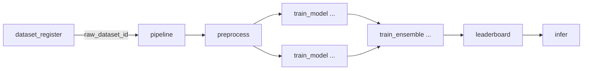

# 02_ARCHITECTURE（全体アーキテクチャ）

## 原則
- 各プロセスは **独立タスク**として実行可能
- 追跡性は **manifest/out.json/properties** によって担保
- 親子タスクは比較目的で作らない（PipelineController の親子関係はオーケストレーション用途に限定）

## タスクの依存関係（概略）

- `pipeline` は「接着剤」。重い処理を持たず、`raw_dataset_id` を受けて実行制御を行う。
- dataset_register は別タスクで実行し、pipeline からは呼ばない（リハーサル runner は順に実行する）。
- `leaderboard` は比較と推奨の唯一の場所。

## Metadata Linking（追跡性）
- 各タスクは `out.json` と `manifest.json` を出力する
- `pipeline` は `pipeline_run.json` を出力し、実行した task_id 一覧を保存する
- 比較可能性のキー：`processed_dataset_id` と `split_hash`
