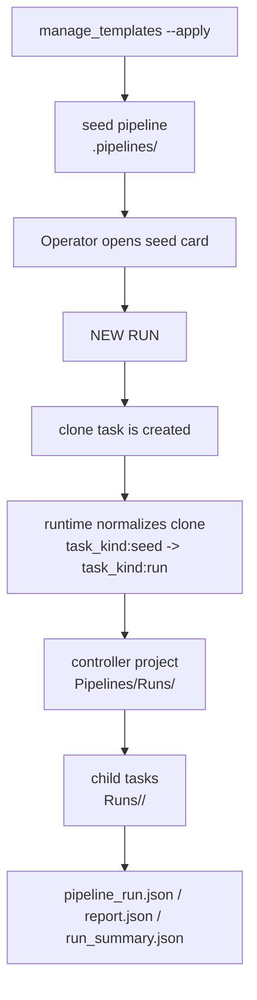

# 03_CLEARML_UI_CONTRACT（ClearML UI 契約）

このドキュメントは **非DSユーザーが ClearML UI だけで判断できる**ための契約です。

## 全体像

現在の ClearML UI 契約は、**seed pipeline を UI 上の正本**として見せ、実行時はその clone を **actual run controller** に正規化する、という二段構えです。

この契約のポイント:

- operator が直接触る起点は `.pipelines/<profile>` の seed card
- `NEW RUN` 後の clone は、そのまま seed の metadata を持ち続けるのではなく runtime が run metadata へ正規化する
- controller と child task は、project tree 上で `Pipelines/Runs/<usecase_id>` と `Runs/<usecase_id>/<group>` に分離される

## Project 階層（config-driven）

operator が主に見る階層:

- pipeline seed: `<ROOT>/<solution_root>/.pipelines/<profile>`
- pipeline run: `<ROOT>/<solution_root>/Pipelines/Runs/<usecase_id>`
- child task run: `<ROOT>/<solution_root>/Runs/<usecase_id>/<process_group>`
- step template: `<ROOT>/<solution_root>/Templates/Steps/<process_group>`

- ROOT: `run.clearml.project_root`（または `TABULAR_ANALYSIS_CLEARML_PROJECT_ROOT`）
- solution_root: `run.clearml.project_layout.solution_root`（例: `TabularAnalysis`）
- usecase_id: `run.usecase_id`（未指定なら `run.usecase_id_policy` で自動生成）
- process_group: `run.clearml.project_layout.group_map[process]`（未定義は `run.clearml.project_layout.misc_group`）
- 設定ファイル: `conf/clearml/project_layout.yaml`

例（デフォルト）：
- `MFG/TabularAnalysis/.pipelines/pipeline`
- `MFG/TabularAnalysis/Pipelines/Runs/test_toy_20260101_120000`
- `MFG/TabularAnalysis/Templates/Steps/03_TrainModels`
- `MFG/TabularAnalysis/Runs/test_toy_20260101_120000/01_Datasets`
- `MFG/TabularAnalysis/Runs/test_toy_20260101_120000/02_Preprocess`
- `MFG/TabularAnalysis/Runs/test_toy_20260101_120000/03_TrainModels`
- `MFG/TabularAnalysis/Runs/test_toy_20260101_120000/04_Ensembles`
- `MFG/TabularAnalysis/Runs/test_toy_20260101_120000/05_Infer`
- `MFG/TabularAnalysis/Runs/test_toy_20260101_120000/05_Infer_Children`（batch/optimize の child）
- `MFG/TabularAnalysis/Runs/test_toy_20260101_120000/99_Leaderboard`

補足:

- seed card 自体は `.pipelines/<profile>` に固定で置かれるため、seed の `run.usecase_id=TabularAnalysis` が project path に反映されることはありません
- actual run では `run.usecase_id` が明示値か、自動採番された値に置き換わり、その値が `Pipelines/Runs/<usecase_id>` と `Runs/<usecase_id>/<group>` に反映されます

## Task 名（推奨）
`<process>__<variant>__v<schema_version>`

例：
- `train_model__lgbm__preprocess=stdscaler_ohe__v1`

## Tags（最低限、固定キー）
- `usecase:<usecase_id>`
- `process:<process>`
- `schema:<schema_version>`
- `grid:<grid_run_id>`（pipeline 実行時）
- skip 時は `skipped:true`, `skip_reason:<reason>` を追加する

追加タグは `run.clearml.policy.tags` / `run.clearml.extra_tags` で付与できるが、上記キーは必須。
## User Properties（固定キー）
- `usecase_id`
- `process`
- `schema_version`
- `code_version`
- `platform_version`
- `grid_run_id`

追加の user properties は `run.clearml.policy.properties` で付与できるが、上記キーは必須。
追加（プロセス別）例：
- preprocess: `processed_dataset_id`, `split_hash`, `recipe_hash`
- train_model: `processed_dataset_id`, `split_hash`, `model_id`, `primary_metric`, `best_score`, `task_type`, `n_classes`
- train_ensemble: `processed_dataset_id`, `split_hash`, `model_id`, `primary_metric`, `best_score`, `task_type`, `n_classes`
- leaderboard: `recommended_ref_kind`, `recommended_infer_key`, `recommended_infer_value`, `recommended_train_task_id`, `recommended_registry_model_id`, `excluded_count`

## HyperParameters（汚染防止：重要）
- **そのタスクの再現に必要な入力のみ**を記録する
- pipeline の設定や出力値を train の HyperParameters に混ぜない

seed pipeline について:

- `.pipelines/<profile>` にある seed pipeline は profile 固定の DAG です
- `Hyperparameters` の正本は plain dotted key の `Args` です
- `Configuration > OperatorInputs` は grouped mirror で、実編集の正本ではありません
- operator が通常触る主要項目は `run.usecase_id`, `data.raw_dataset_id`, `pipeline.selection.enabled_preprocess_variants`, `pipeline.selection.enabled_model_variants`、必要時のみ `ensemble.selection.enabled_methods`, `ensemble.top_k` です
- `pipeline.profile`, `pipeline.model_set`, `pipeline.grid.*`, `data.split.*`, `eval.*` などは current seed の見える値として `Hyperparameters` に出します
- 固定 DAG の内部値である `pipeline.run_*` と `pipeline.plan_only` は operator 用 `Hyperparameters` には出しません。これらは seed profile と runtime 正規化で決まります
- seed pipeline の標準運用は `pipeline.run_dataset_register=false` 前提で、dataset 登録は rehearsal / 準備系導線に分けます
- seed card の `Configuration > OperatorInputs` は read-only mirror で、`data.raw_dataset_id=REPLACE_WITH_EXISTING_RAW_DATASET_ID` が見えても正常です
- 実際に編集する場所は `Hyperparameters` です
- `run.usecase_id` を seed 既定値 `TabularAnalysis` のまま起動した場合でも、actual run では runtime が一意な `<usecase_id>` を採番し、run controller は `Pipelines/Runs/<usecase_id>`、child task は `Runs/<usecase_id>/<process_group>` に着地します

### 概念名と実 UI key 名

- `Configuration > OperatorInputs` は concept を nested HOCON で mirror した表示です
- `Hyperparameters` は current seed / current `NEW RUN` では plain dotted key を表示します
- `Args/*` が source of truth で、`run.clearml.*` などの bootstrap key も同じ section に出ます
- `%2E` を含む key や `Args/data.raw_dataset_id` と `Args/data/raw_dataset_id` の同居が見えた場合は、historical task か deprecated task を開いている可能性が高いです

| 概念名 | `Hyperparameters` の実 UI key | `OperatorInputs` の見え方 |
| --- | --- | --- |
| `run.usecase_id` | `run.usecase_id` | `run { usecase_id = ... }` |
| `data.raw_dataset_id` | `data.raw_dataset_id` | `data { raw_dataset_id = ... }` |
| `pipeline.selection.enabled_preprocess_variants` | `pipeline.selection.enabled_preprocess_variants` | `pipeline { selection { enabled_preprocess_variants = [...] } }` |
| `pipeline.selection.enabled_model_variants` | `pipeline.selection.enabled_model_variants` | `pipeline { selection { enabled_model_variants = [...] } }` |
| `ensemble.selection.enabled_methods` | `ensemble.selection.enabled_methods` | `ensemble { selection { enabled_methods = [...] } }` |
| `ensemble.top_k` | `ensemble.top_k` | `ensemble { top_k = ... }` |

### operator が UI で触る面

| 画面 | 用途 | 書き換えてよいか | 代表項目 |
| --- | --- | --- | --- |
| `Configuration > OperatorInputs` | 確認用 mirror | いいえ | `run { usecase_id }`, `data { raw_dataset_id }`, `pipeline { profile, selection, grid, model_set }`, `ensemble { selection, top_k }`, `eval { ... }` |
| `Hyperparameters` | 実編集の正本 | はい | `run.usecase_id`, `data.raw_dataset_id`, `data.split.*`, `pipeline.selection.*`, `ensemble.selection.enabled_methods`, `ensemble.top_k`, `pipeline.profile`, `pipeline.model_set`, `pipeline.grid.*`, `eval.*` |

### seed card と actual run の差

| 項目 | seed card | actual run |
| --- | --- | --- |
| `task_kind` | `seed` | `run` |
| project | `.pipelines/<profile>` | `Pipelines/Runs/<usecase_id>` |
| `data.raw_dataset_id` | placeholder 可 | placeholder 不可 |
| `run.usecase_id` | `TabularAnalysis` 既定値を持ってよい | 明示値または runtime 自動採番値 |
| `OperatorInputs` | seed 既定値の mirror | current values の mirror |

### 実装正本

- project path / group map
  - `conf/clearml/project_layout.yaml`
  - `src/tabular_analysis/ops/clearml_identity.py`
- operator UI contract / 実 UI key 対応
  - `src/tabular_analysis/clearml/pipeline_ui_contract.py`
- seed profile / placeholder / UI clone 正規化
  - `src/tabular_analysis/processes/pipeline_support.py`
- seed publish / drift validate / stale cleanup
  - `tools/clearml_templates/seed_publish.py`
  - `tools/clearml_templates/drift_validate.py`
  - `tools/clearml_templates/stale_cleanup.py`
- controller orchestration
  - `src/tabular_analysis/processes/pipeline.py`
- seed apply / validate / stale cleanup
  - `tools/clearml_templates/manage_templates.py`

## Artifacts（全タスク必須）
- `config_resolved.yaml`
- `out.json`
- `manifest.json`

プロセス別追加（例）：
- preprocess: `recipe.json`, `summary.md`, `preprocess_bundle.*`, `schema.json`
- train_model: `metrics.json`, `metrics_ci.json` (when `eval.ci.enabled=true`), `model_bundle/*`, `model_card.md`, `feature_importance.csv`, `feature_importance.png`, `residuals.png`, `confusion_matrix.csv`, `confusion_matrix.png`, `roc_curve.png`
- train_ensemble: `metrics.json`, `ensemble_spec.json`, `model_bundle.joblib`
- leaderboard: `leaderboard.csv`, `recommendation.json`, `summary.md`, `decision_summary.md`, `decision_summary.json`, `recommended_plot.png` (optional)
- pipeline: `pipeline_run.json`, `plan.json`, `report.md`, `report.json`, `report_links.json`, `run_summary.json`
- infer: `predictions.*`, `input_preview.*`, `drift_report.json`, `drift_report.md` (when drift enabled)

## 推論参照の表示優先順位

推論参照は、内部では複数の id を保持しても、operator が日常運用で見る順番は固定する。

主表示:

- `recommended_infer_key`
- `recommended_infer_value`
- `recommended_ref_kind`

補助表示:

- `recommended_registry_model_id`
- `recommended_train_task_id`
- `recommended_model_id`

意味:

- operator が `Infer` の `Hyperparameters` にそのまま入れるのは `recommended_infer_key` と `recommended_infer_value`
- `recommended_registry_model_id` は昇格済みモデル管理の確認用
- `recommended_train_task_id` は実験・比較・再現の確認用
- `recommended_model_id` は互換・診断用の補助情報で、主表示の正本ではない

ClearML UI での見せ方:

- `99_Leaderboard` の `PLOTS -> leaderboard/table` は `infer_key`, `infer_value`, `ref_kind` を action 列として先に見る
- `summary.md`, `decision_summary.md`, `report.md` の冒頭も同じ順で表示する
- `user properties` でも `recommended_infer_key` / `recommended_infer_value` を最優先に確認する

`99_Leaderboard` の `PLOTS -> leaderboard/table` には、推論 task を UI で起動するための列も表示する。

- `infer_key`
- `infer_value`
- `ref_kind`

意味:

- `ref_kind=model_id` の行は `infer.model_id=<infer_value>`
- `ref_kind=train_task_id` の行は `infer.train_task_id=<infer_value>`

推論 task を UI で clone したら、上記の `infer_key` と `infer_value` を `Hyperparameters` にそのまま入力すればよい。
`recommended_model_id` は互換・補助情報として残るが、operator が日常運用で優先して見る値は `recommended_infer_key` / `recommended_infer_value` / `recommended_ref_kind` とする。
- skip 時: `skip_reason.json`

## Lint ルール（doctor/CI）
- 必須 artifact: `config_resolved.yaml`, `out.json`, `manifest.json`
- `manifest.json` 必須キー: `schema_version`, `code_version`, `platform_version`, `process`, `created_at`, `inputs`, `outputs`, `hashes.config_hash`
- `out.json` 必須キー（プロセス別）
  - dataset_register: `raw_dataset_id`
  - preprocess: `processed_dataset_id`, `split_hash`, `recipe_hash`
  - train_model: `model_id`, `primary_metric`, `best_score`, `task_type`
  - train_ensemble: `model_id`, `primary_metric`, `best_score`, `task_type`
  - leaderboard: `leaderboard_csv`, `recommended_model_id`
  - infer: `predictions_path`
  - pipeline: `pipeline_run`
- skip 時の `out.json` は `status="skipped"` と `reason` を必須で含める
- 任意 artifact は **存在すれば整形チェックのみ**（JSON は parse、MD は空でないこと）
- 実行例: `python -m tabular_analysis.doctor --lint-run <output_dir> --mode fail`

## Plots（軽量デフォルト）
- デフォルトは軽い図（重要度・残差など）
- 例: `feature_importance.png`, `residuals.png`, `confusion_matrix.png`, `roc_curve.png`
- SHAP 等の重い可視化は config フラグでオンデマンド（デフォルトOFF）

