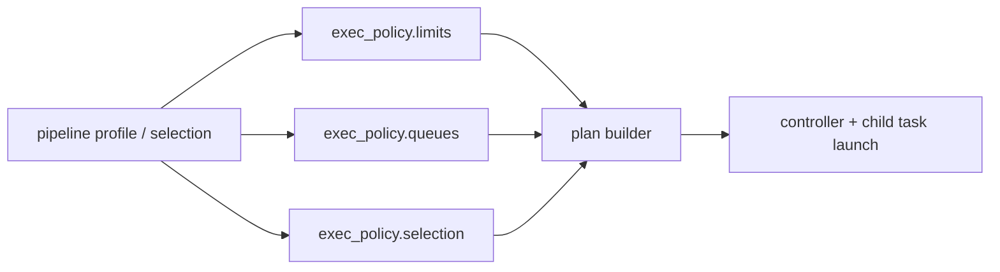

# 22 Execution Policy

## 目的

`exec_policy` は pipeline 実行時の queue、limit、heavy model routing、selection を制御する設定です。  
個々の task 実装に散らさず、実行ポリシーを 1 か所で読めるようにしています。

## source of truth

- `conf/exec_policy/base.yaml`
- `src/tabular_analysis/processes/pipeline_support.py`
- `src/tabular_analysis/processes/pipeline.py`

## 全体像



役割分担:

- `pipeline profile`
  - fixed DAG の母集合を決める
- `selection`
  - その母集合のうち何を有効にするかを決める
- `exec_policy`
  - どの queue に流すか、どこまで実行するか、重い補助機能を有効化するかを決める

## 主な設定

### limits

- `exec_policy.limits.max_jobs`
  - pipeline が計画できる train job の上限
- `exec_policy.limits.max_models`
  - report / leaderboard に出す上限
- `exec_policy.limits.max_hpo_trials`
  - model ごとの HPO 試行回数

## queues

- `exec_policy.queues.default`
  - 基本 queue
- `exec_policy.queues.pipeline`
  - controller queue
- `exec_policy.queues.train_model_heavy`
  - heavy model queue
- `exec_policy.queues.model_variants`
  - variant 個別 override
- `exec_policy.queues.heavy_model_variants`
  - heavy queue に送る variant 一覧

現在の標準:

- `controller`
  - pipeline controller
- `default`
  - preprocess、light train、leaderboard、ensemble、infer
- `heavy-model`
  - `catboost`、`xgboost`

queue 解決の優先順位:

1. `exec_policy.queues.model_variants[<model>]`
2. `exec_policy.queues.train_model_heavy` と `exec_policy.queues.heavy_model_variants`
3. `exec_policy.queues.train_model`
4. `exec_policy.queues.default`

補足:

- `run.clearml.queue_name` は pipeline child routing の正本ではありません
- pipeline mode では `exec_policy.queues.*` が child task routing の正本です

## selection

- `exec_policy.selection.calibration`
- `exec_policy.selection.uncertainty`
- `exec_policy.selection.ci`

重い機能を標準では無効にし、必要時だけ opt-in するためのフラグです。

現在の既定:

- `calibration=false`
- `uncertainty=false`
- `ci=false`

## pipeline との関係

`exec_policy` は「何をどれだけ実行してよいか」を決めます。  
実際の candidate 展開は pipeline の plan builder が行います。

### 典型例

- model set を展開する
- heavy model を `heavy-model` に送る
- `max_jobs` を超える場合は plan 側で制限する
- 非選択候補や policy で落とした候補は report に残す

## よく使う override 例

```bash
python -m tabular_analysis.cli task=pipeline \
  run.clearml.enabled=true \
  run.clearml.execution=pipeline_controller \
  exec_policy.queues.default=default \
  exec_policy.queues.train_model_heavy=heavy-model \
  exec_policy.queues.heavy_model_variants=[catboost,xgboost] \
  exec_policy.limits.max_jobs=20
```

## heavy model routing

現在の標準 heavy model:

- `catboost`
- `xgboost`

`lgbm` は heavy queue ではなく `default` に残します。

## 運用上の考え方

- queue 分割は operator 視点で理解しやすい単位にする
- HPO や uncertainty のような重い処理は selection で明示制御する
- limit 超過は hidden failure にせず report / run_summary に残す

## architect 観点での要点

- fixed DAG と selection は `pipeline` 側の責務
- queue / limit / heavy routing / heavy optional feature は `exec_policy` 側の責務
- この分離により、profile 変更と cluster 運用変更を独立に扱える


