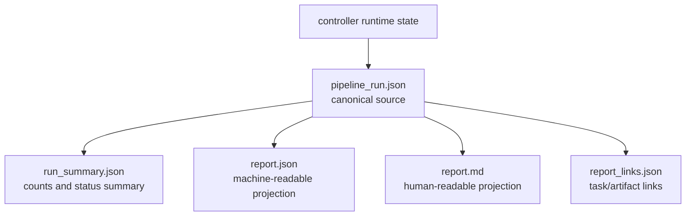
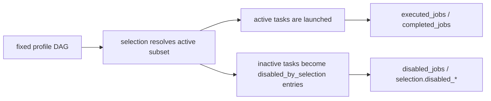

# 24 Reporting

## 目的

この repo の reporting は、operator と開発者が「何が起きたか」を task 出力だけで追えるようにすることを目的にしています。

## pipeline reporting の位置づけ

pipeline reporting は markdown を出すだけではありません。  
controller 実行の lifecycle、selection、task ref、件数要約を複数 artifact に投影する仕組みです。

## reporting の層

### task local output

各 task は stage directory に report 相当の情報を出します。

### ClearML UI

必要な scalars、plots、tables、artifacts を UI から見られるようにします。

### pipeline summary

pipeline は複数 task の結果を `report.md` / `report.json` に集約します。

## 代表的な report artifact

### preprocess

- `summary.md`
- `data_quality.json`
- `data_quality.md`

### train_model

- `metrics.json`
- plots / scalars

### leaderboard

- `leaderboard.csv`
- `recommendation.json`
- `summary.md`

### pipeline

- `pipeline_run.json`
- `run_summary.json`
- `report.md`
- `report.json`
- `report_links.json`

## report.md と report.json の使い分け

### `report.md`

- 人が読む要約
- operator 向け

### `report.json`

- 機械可読の summary
- automation / regression check 向け
- lifecycle の正本は `pipeline_run.json`
- `report.json` と `run_summary.json` はその状態を読みやすく投影したもの

### `pipeline_run.json`

- lifecycle の canonical source
- selection、step refs、status、disabled entries の正本
- architect や regression test が最初に見るべき artifact

## pipeline report で必ず見たい項目

- `grid_run_id`
- `status`
- `recommended_train_task_id`
- `infer_model_id`
- `primary_metric`
- `best_score`
- `planned_jobs`
- `requested_jobs`
- `executed_jobs`
- `disabled_jobs`
- `completed_jobs`
- `failed_jobs`
- `stopped_jobs`
- `running_jobs`
- `queued_jobs`
- `skipped_due_to_policy`
- `selection.requested_*`
- `selection.active_*`
- `selection.disabled_*`

## partial failure の扱い

pipeline は `pipeline_run.json` を lifecycle の canonical source とし、stopped / skipped / partial failure の情報も `run_summary.json` と `report.json` に残します。  
途中で止まっても「どこまで完了したか」が分かることを重視しています。

## selection subset の扱い

fixed DAG の seed pipeline では、run ごとの差は graph 変更ではなく selection で表現します。

- `pipeline.selection.enabled_preprocess_variants`
- `pipeline.selection.enabled_model_variants`
- `ensemble.selection.enabled_methods`

非選択候補は v1 では child task を作らず、`pipeline_run.json` / `run_summary.json` / `report.json` に

- `disabled_jobs`
- `disabled_selection`
- `selection.disabled_*`

として記録します。

## status と件数の読み方

| 項目 | 意味 |
| --- | --- |
| `requested_jobs` | profile 母集合として見た元の候補数 |
| `planned_jobs` | selection / limits 後に実行対象として残った件数 |
| `executed_jobs` | 実際に launch された job 数 |
| `disabled_jobs` | `disabled_by_selection` として記録された件数 |
| `skipped_due_to_policy` | policy や limit で落とした件数 |
| `completed_jobs` / `failed_jobs` / `stopped_jobs` / `running_jobs` / `queued_jobs` | 実行状態の内訳 |

architect 観点では、`requested_jobs != planned_jobs != executed_jobs` があり得る前提で読む必要があります。

## selection と report の関係

## 関連ドキュメント

- [24_REPORTING.md](24_REPORTING.md)
- [51_CLEARML_PLOTS_SCALARS_DEBUGSAMPLES_CONTRACT.md](51_CLEARML_PLOTS_SCALARS_DEBUGSAMPLES_CONTRACT.md)
- [60_PIPELINE_TRAIN_CONTRACT.md](60_PIPELINE_TRAIN_CONTRACT.md)

