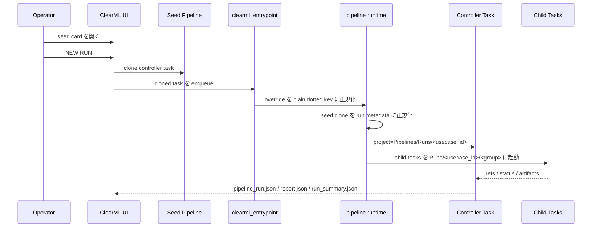

# 52 ClearML Pipeline Controller Contract

## 目的

`task=pipeline` を ClearML 上で operator が理解しやすい controller task として扱うための契約です。

## 正本の考え方

pipeline 実行の正本は seed pipeline です。  
runtime は hidden controller を ad hoc に作らず、seed pipeline から run controller を起動します。

## 実行シーケンス

この sequence のうち、architect が押さえるべきポイントは次です。

- UI が作るのは seed の clone だが、runtime はそれをそのまま実行しない
- `clearml_entrypoint` が legacy key を plain dotted key に正規化してから Hydra に渡す
- `pipeline` runtime が current task を `task_kind:run` に切り替え、project と tags/properties を run 向けへ組み替える
- child task の project tree は controller project と意図的に分けている

## seed pipeline 側

seed pipeline は次を満たします。

- `TaskTypes.controller`
- `process:pipeline`
- `task_kind:seed`
- `pipeline_profile:<name>`
- project: `<project_root>/TabularAnalysis/.pipelines/<profile>`

seed pipeline は **editable template** ではなく **visible base run** と考えると理解しやすいです。  
UI 上では card として見えますが、operator が任意 DAG を組み替えるための generic pipeline builder ではありません。

## run controller 側

run controller は seed pipeline から起動された後に runtime metadata へ上書きされます。

必須の考え方:

- `task_kind:run`
- `usecase:<actual>`
- `template:true` は残さない
- project は `<project_root>/TabularAnalysis/Pipelines/Runs/<usecase_id>`
- seed clone の `run.usecase_id` が seed 既定値 `TabularAnalysis` のままでも、actual run では runtime が一意な `<usecase_id>` を採番する
- `Configuration > OperatorInputs` は current run values を mirror するが、実編集の正本は `Hyperparameters`
- `data.raw_dataset_id` が seed placeholder のままなら controller 開始時に fail-fast する

run controller 正規化で必ず揃えるもの:

- `task_kind:run`
- `usecase:<actual>`
- `project=<project_root>/TabularAnalysis/Pipelines/Runs/<usecase_id>`
- current values の `Configuration > OperatorInputs`
- `pipeline_run.json`, `report.json`, `run_summary.json`

## child task 側

child task は runtime identity を再構築します。

例:

- `process:preprocess`
- `preprocess:stdscaler_ohe`
- `process:train_model`
- `model:lgbm`
- `grid:<grid_run_id>`

step template tag や stale usecase は残しません。
child project は `<project_root>/TabularAnalysis/Runs/<usecase_id>/<group>` に切り替わります。

代表 group:

- `01_Datasets`
- `02_Preprocess`
- `03_TrainModels`
- `04_Ensembles`
- `05_Infer`
- `05_Infer_Children`
- `99_Leaderboard`

## queue 契約

- controller
  - `controller`
- light child
  - `default`
- heavy child
  - `heavy-model`

## artifact

controller は次を出します。

- `pipeline_run.json`
- `report.md`
- `report.json`
- `report_links.json`
- `run_summary.json`

## Source Of Truth

- runtime normalization / whitelist / placeholder fail-fast
  - `src/tabular_analysis/processes/pipeline_support.py`
- controller orchestration
  - `src/tabular_analysis/processes/pipeline.py`
- project / tag / property naming
  - `src/tabular_analysis/ops/clearml_identity.py`
- live seed apply / validate
  - `tools/clearml_templates/manage_templates.py`

