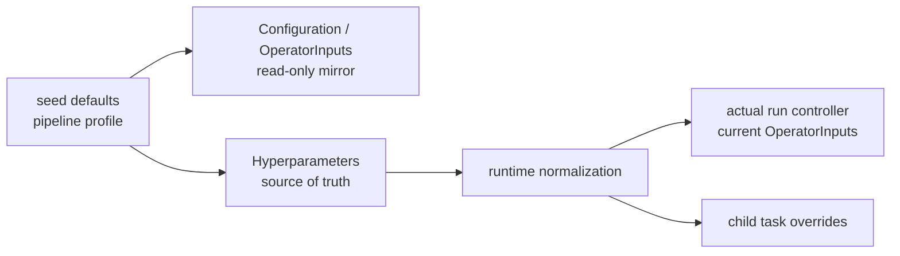
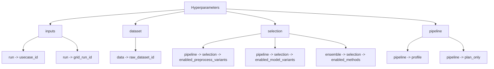

# 61 ClearML HyperParameters Sections

## 目的

HyperParameters を section ごとに分け、operator が UI で設定の要点を読みやすくするための整理です。

## 設定の流れ

この図で大事なのは、**`OperatorInputs` は確認用、`Hyperparameters` が実行ソースの正本**という点です。

## UI 表示のルール

- current seed と current `NEW RUN` では、Hyperparameters section は **nested object** として接続されます
- つまり UI 上では `run.usecase_id` のような flat dotted key が大量に並ぶのではなく、
  - `inputs -> run -> usecase_id`
  - `dataset -> data -> raw_dataset_id`
  - `selection -> pipeline -> selection -> enabled_model_variants`
  のような階層表示が正本です
- `%2E` を含む key は current runtime の設計値ではありません
  - それが見える場合は historical task に残った古い payload か、異常系の task clone を疑ってください
- `Args/*` は runtime source-of-truth なので dotted key を持ちますが、operator が UI で主に読むのは section 表示と `Configuration > OperatorInputs` です

## 既定 section

- `inputs`
- `dataset`
- `selection`
- `preprocess`
- `model`
- `eval`
- `optimize`
- `pipeline`
- `clearml`

## 代表例

### inputs

- `run.usecase_id`
- `run.output_dir`
- `data.dataset_path`
- `infer.mode`

### dataset

- `data.target_column`
- `data.raw_dataset_id`
- `data.processed_dataset_id`

### selection

- `pipeline.selection.enabled_preprocess_variants`
- `pipeline.selection.enabled_model_variants`
- `ensemble.selection.enabled_methods`

### preprocess

- `preprocess.*`
- `data.split.*`

### model

- `group/model`
- `train.*`

### eval

- `eval.*`
- `leaderboard.*`

### pipeline

- `pipeline.profile`
- `pipeline.run_*`
- `pipeline.plan_only`
- `pipeline.model_set`

## nested 例

flat dotted key のまま UI に出すのではなく、nested section にしている理由は 2 つです。

- ClearML UI で `%2E` のような encoded key が乱立しにくくなる
- operator / architect が section ごとに設定責務を追いやすくなる

seed pipeline の標準運用では、operator は主に次を編集します。

- `run.usecase_id`
- `data.raw_dataset_id`
- `pipeline.selection.enabled_preprocess_variants`
- `pipeline.selection.enabled_model_variants`
- `ensemble.selection.enabled_methods`
- `ensemble.top_k` (`train_ensemble_full` のみ)

### profile ごとの UI 編集面

| seed profile | 基本編集項目 | 追加編集項目 |
| --- | --- | --- |
| `pipeline` | `run.usecase_id`, `data.raw_dataset_id`, `pipeline.selection.enabled_preprocess_variants`, `pipeline.selection.enabled_model_variants` | なし |
| `train_model_full` | `run.usecase_id`, `data.raw_dataset_id`, `pipeline.selection.enabled_preprocess_variants`, `pipeline.selection.enabled_model_variants` | なし |
| `train_ensemble_full` | `run.usecase_id`, `data.raw_dataset_id`, `pipeline.selection.enabled_preprocess_variants`, `pipeline.selection.enabled_model_variants` | `ensemble.selection.enabled_methods`, `ensemble.top_k` |

確認場所の優先順は次です。

- `Configuration > OperatorInputs`
  - operator が見るべき最小入力だけを mirror した read-only 表示
  - seed card では `data.raw_dataset_id=REPLACE_WITH_EXISTING_RAW_DATASET_ID` が見えても正常
  - cloned run の current values をざっと確認するときもここを使う
- `Hyperparameters`
  - 実行ソースの正本
  - 互換 key や低レベル override もここに残る
  - `data.raw_dataset_id` を実際に差し替えるときもこちらを使う
  - seed 既定値 `run.usecase_id=TabularAnalysis` を明示変更しない場合も、actual run では runtime が一意な usecase へ自動採番する

### seed と actual run の読み方

| 項目 | seed card | actual run |
| --- | --- | --- |
| `run.usecase_id` | `TabularAnalysis` 既定値を持ってよい | runtime が actual value へ正規化 |
| `data.raw_dataset_id` | placeholder 可 | placeholder 不可 |
| `OperatorInputs` | seed 既定値の mirror | current values の mirror |
| `Hyperparameters` | 実編集前の初期値 | 実行時の source of truth |

seed pipeline の operator UI では、graph-shaping key を直接編集しません。

- `pipeline.model_variants`
- `pipeline.grid.model_variants`
- `pipeline.hpo.*`

これらは local / ad hoc 実行や開発者向け config の互換用として残し、通常の clone / run 導線では `selection` section を使います。

## Source Of Truth

- UI editable whitelist / operator inputs mirror
  - `src/tabular_analysis/processes/pipeline_support.py`
- section 分類
  - `conf/clearml/hyperparams_sections.yaml`
- actual task parameter write/reset
  - `src/tabular_analysis/platform_adapter_task_ops.py`

### clearml

- `run.clearml.enabled`
- `run.clearml.execution`
- `run.clearml.project_root`
- `run.clearml.code_ref.*`

