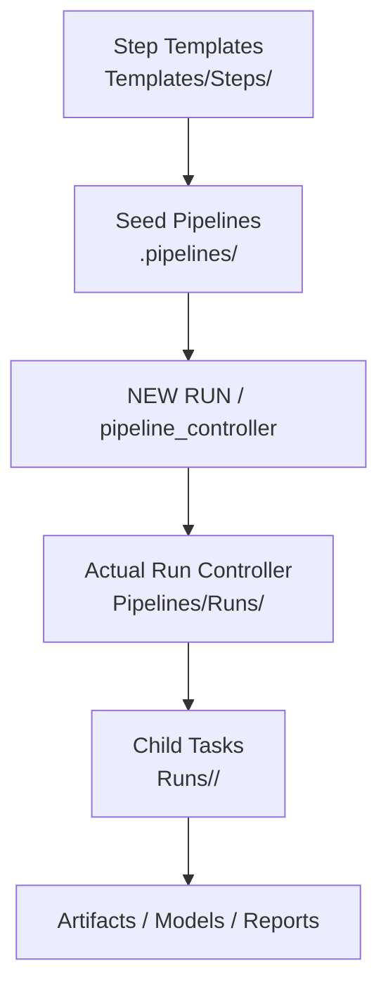
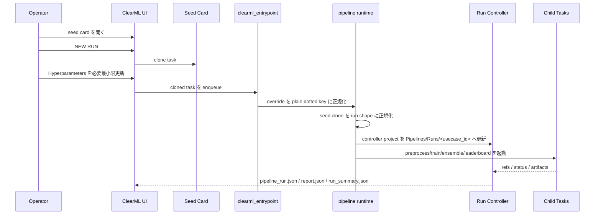
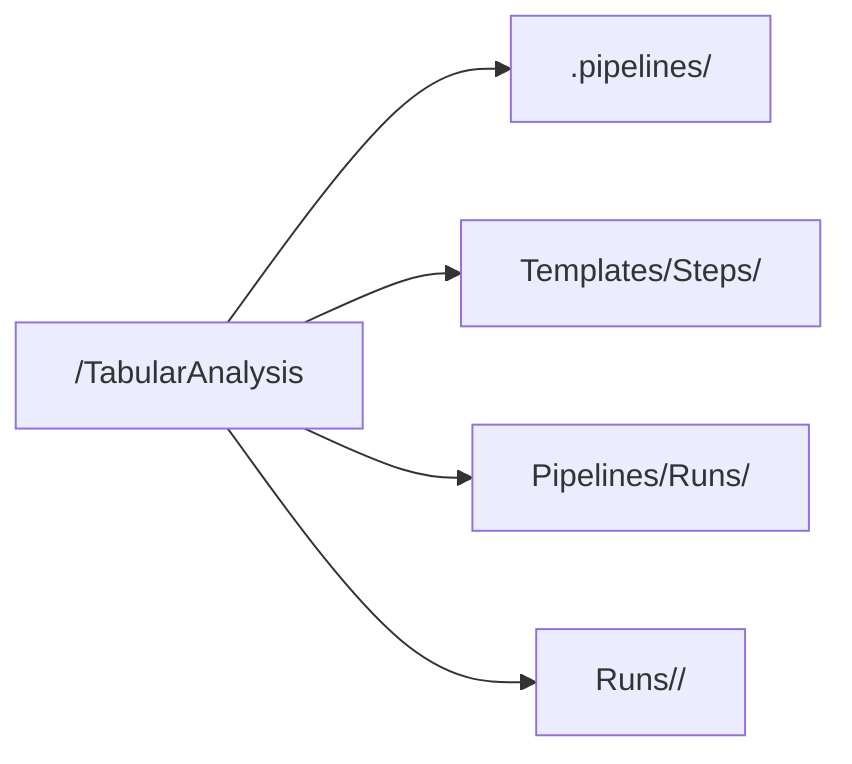
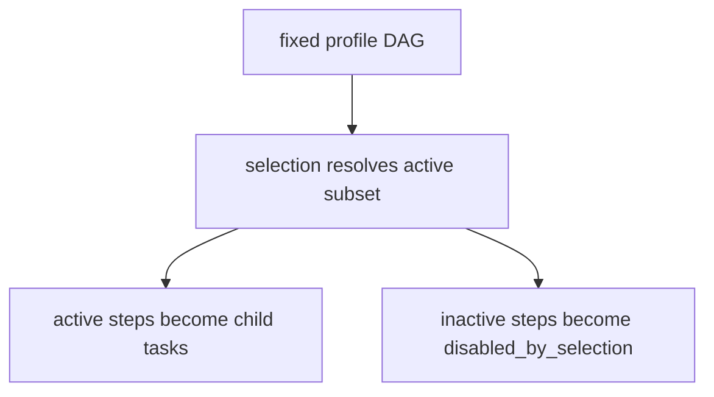

# 87 ClearML Pipeline Workflow Details

このドキュメントは、現在の ClearML pipeline workflow を **第三者のアーキテクトや新規参加 developer が、実装と UI の両面から追える粒度**で整理したものです。  
operator 向けの最短手順は [17_OPERATOR_QUICKSTART.md](17_OPERATOR_QUICKSTART.md)、日常 runbook は [16_OPERATIONS_RUNBOOK.md](16_OPERATIONS_RUNBOOK.md) を参照してください。

## 1. 現在の 4 層モデル

現在の pipeline 実装は、次の 4 層を明確に分けています。

- seed pipeline
  - `.pipelines/<profile>`
- actual run controller
  - `Pipelines/Runs/<usecase_id>`
- child task
  - `Runs/<usecase_id>/<group>`
- step template
  - `Templates/Steps/<group>`



重要:

- operator の正規入口は seed card の `NEW RUN`
- `NEW PIPELINE` は current contract の対象外
- step template と seed pipeline は別物
- 実編集の正本は `Hyperparameters`
- `Configuration > OperatorInputs` は read-only mirror

## 2. built-in seed profiles

現在の built-in seed profile は 3 つです。

| profile | run_dataset_register | run_preprocess | run_train | run_train_ensemble | run_leaderboard | run_infer | model_set | 用途 |
| --- | --- | --- | --- | --- | --- | --- | --- | --- |
| `pipeline` | false | true | true | false | true | false | `regression_all` | 標準学習 |
| `train_model_full` | false | true | true | false | false | false | `regression_all` | 単体モデル群のみ |
| `train_ensemble_full` | false | true | true | true | true | false | `regression_all` | フル構成 |

`train_ensemble_full` は追加で次の ensemble method を built-in で持ちます。

- `mean_topk`
- `weighted`
- `stacking`

## 3. seed card から actual run までの実行シーケンス



この sequence で押さえるべき点:

- UI が作るのは seed の clone であり、完成済みの actual run ではない
- `clearml_entrypoint` が `%2E` / `%2F` を含む historical key を plain dotted key に戻してから Hydra に渡す
- `pipeline` runtime が current task を `task_kind:run` と actual project path に正規化する
- child task は step template から作られるが、identity は run 用に再構築される

## 4. runtime 正規化で何が変わるか

seed clone は実行開始時に次のように変換されます。

| 項目 | seed clone | actual run |
| --- | --- | --- |
| `task_kind` | `seed` | `run` |
| project | `.pipelines/<profile>` | `Pipelines/Runs/<usecase_id>` |
| `run.usecase_id` | seed 既定値を持ってよい | actual value に正規化 |
| `OperatorInputs` | seed 既定値の mirror | current values の mirror |
| `data.raw_dataset_id` | placeholder 可 | placeholder 不可 |

runtime 正規化で必ず揃えるもの:

- `task_kind:run`
- `usecase:<actual>`
- `project=<project_root>/TabularAnalysis/Pipelines/Runs/<usecase_id>`
- current values の `Configuration > OperatorInputs`
- `pipeline_run.json`
- `report.json`
- `run_summary.json`

## 5. operator が UI で見る面

### 5.1 `Configuration > OperatorInputs`

read-only mirror です。  
seed card でも actual run でも、「operator がまず確認したい最小入力」をまとめて見せます。

代表項目:

- `run.usecase_id`
- `data.raw_dataset_id`
- `pipeline.selection.enabled_preprocess_variants`
- `pipeline.selection.enabled_model_variants`
- `ensemble.selection.enabled_methods`
- `ensemble.top_k`

### 5.2 `Hyperparameters`

実行ソースの正本です。  
UI で値を実際に変更する場所はこちらです。

### 5.3 seed と actual run の読み方

| 項目 | seed card | actual run |
| --- | --- | --- |
| `run.usecase_id` | `TabularAnalysis` 既定値でよい | actual value に正規化 |
| `data.raw_dataset_id` | `REPLACE_WITH_EXISTING_RAW_DATASET_ID` でよい | placeholder 不可 |
| `OperatorInputs` | seed 既定値の mirror | current values の mirror |
| `Hyperparameters` | 実編集前の初期値 | source of truth |

## 6. `run.usecase_id` の扱い

seed 既定値は `TabularAnalysis` です。  
ただし actual run では、そのまま使うことを前提にしていません。

runtime の方針:

- operator が明示値を入れた場合
  - その値を使う
- seed 既定値 `TabularAnalysis` のまま actual run を開始した場合
  - `run.usecase_id_policy` に従って一意値を自動採番する

現在の標準 policy は `test_dataset_timestamp` で、strategy は `dataset_timestamp` です。  
生成例:

```text
test_e285ff784b9046b7b1f9920e54e3fe93_20260405_140419
```

## 7. `data.raw_dataset_id` placeholder の意味

seed card では placeholder を意図的に持ちます。

```text
REPLACE_WITH_EXISTING_RAW_DATASET_ID
```

これは seed が「まだ actual run ではない」ことを UI 上で明確にするためです。  
actual run では次を禁止します。

- empty
- placeholder のまま
- `local:` dataset を使うのに `data.dataset_path` が空

この fail-fast は `pipeline_support.py` の `validate_pipeline_operator_inputs()` が正本です。

## 8. project layout

`conf/clearml/project_layout.yaml` の current 正本は次です。

- `solution_root: TabularAnalysis`
- `pipeline_root_group: Pipelines`
- `pipeline_runs_group: Runs`
- `pipeline_seed_namespace: .pipelines`
- `templates_root_group: Templates`
- `step_templates_group: Steps`
- `runs_root_group: Runs`

group map:

| process | group |
| --- | --- |
| `dataset_register` | `01_Datasets` |
| `preprocess` | `02_Preprocess` |
| `train_model` | `03_TrainModels` |
| `train_ensemble` | `04_Ensembles` |
| `infer` | `05_Infer` |
| `infer_child` | `05_Infer_Children` |
| `leaderboard` | `99_Leaderboard` |



## 9. fixed DAG と subset selection

seed profile は fixed DAG です。  
operator が UI 上で DAG 自体を作り替える運用はしません。

subset は次で表します。

- `pipeline.selection.enabled_preprocess_variants`
- `pipeline.selection.enabled_model_variants`
- `ensemble.selection.enabled_methods`

inactive step は child task を作らず、controller summary/report に `disabled_by_selection` として残します。



## 10. queue routing

queue 正本は `exec_policy.queues.*` です。  
`run.clearml.queue_name` は child routing の正本ではありません。

current default:

| queue role | queue |
| --- | --- |
| controller | `controller` |
| light child | `default` |
| heavy model child | `heavy-model` |

heavy model 既定値:

- `catboost`
- `xgboost`

## 11. controller artifact と report の役割

controller が出す主な artifact:

- `pipeline_run.json`
- `report.md`
- `report.json`
- `report_links.json`
- `run_summary.json`

役割は次です。

| artifact | 役割 |
| --- | --- |
| `pipeline_run.json` | 実行計画、selection、job refs、status の正本 |
| `run_summary.json` | 実行件数、成功件数、失敗件数、disabled 件数の要約 |
| `report.json` | UI/reporting 用の構造化 summary |
| `report.md` | 人が読む要約 |
| `report_links.json` | 関連 artifact / task / model へのリンク |

## 12. legacy fallback と historical drift

current operator flow の正本ではないが、互換のため残っているもの:

- `run.clearml.template_usecase_id`
- `run.clearml.pipeline.template_task_id`

意味:

- runtime の read fallback
- helper の explicit override
- current operator flow の主導線ではない

また、historical run には `%2E` を含む key が残ることがあります。  
これは過去に UI clone payload がそのまま保存された名残で、**current runtime failure を意味しません**。  
current seed と新規 `NEW RUN` は plain dotted key を正本にします。

## 13. source of truth 一覧

| 役割 | 正本 |
| --- | --- |
| project path / tag-property contract | `src/tabular_analysis/ops/clearml_identity.py` |
| seed profile / placeholder / whitelist / run normalization | `src/tabular_analysis/processes/pipeline_support.py` |
| controller orchestration | `src/tabular_analysis/processes/pipeline.py` |
| seed lookup | `src/tabular_analysis/clearml/pipeline_templates.py` |
| entrypoint override normalization | `tools/clearml_entrypoint.py` |
| live seed apply / validate / cleanup | `tools/clearml_templates/manage_templates.py` |

## 14. 関連ドキュメント

- [03_CLEARML_UI_CONTRACT.md](03_CLEARML_UI_CONTRACT.md)
- [52_CLEARML_PIPELINE_CONTROLLER_CONTRACT.md](52_CLEARML_PIPELINE_CONTROLLER_CONTRACT.md)
- [53_CLEARML_HYPERPARAMETERS_CONTRACT.md](53_CLEARML_HYPERPARAMETERS_CONTRACT.md)
- [61_CLEARML_HPARAMS_SECTIONS.md](61_CLEARML_HPARAMS_SECTIONS.md)
- [63_CLEARML_PIPELINES_VISIBILITY.md](63_CLEARML_PIPELINES_VISIBILITY.md)
- [81_CLEARML_TEMPLATE_POLICY.md](81_CLEARML_TEMPLATE_POLICY.md)
- [82_CLEARML_PROJECT_LAYOUT.md](82_CLEARML_PROJECT_LAYOUT.md)
- [86_CLEARML_INTERNALS_FOR_DEVELOPERS.md](86_CLEARML_INTERNALS_FOR_DEVELOPERS.md)
